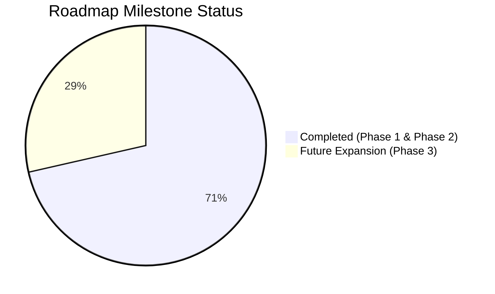

# DevScope — Build Tracker & Technical Changelog

> Real-time tracker of implemented features, bug fixes, schema evolutions, and upcoming roadmap milestones.  
> **Current Version:** `v1.1.0` (Recruiter Intelligence & Private Developer Hardening)  
> **Status:** All Phase 1 milestones completed and verified against production builds.

---

## 1. Executive Status & Component Health

| Subsystem | Health | Current Model / Tech | Key Changes |
|---|---|---|---|
| **LLM Gateway** | 🟢 Healthy | `gemini-3.8-flash` (Primary), Groq & OpenRouter failovers | Model slugs updated; auto-failover on empty/reasoning responses; JSON mode enforced. |
| **Synthesis Agent** | 🟢 Healthy | ReAct + Two-phase compression (Cache v4) | Private/corporate developer bias removed; 15-minute phone screen guide generated. |
| **Investigation Tools** | 🟢 Healthy | 11 deterministic pre-fetch tools | Fast parallel pre-fetch (~1.6s execution). |
| **Frontend UI** | 🟢 Healthy | Next.js 14 (App Router) + Tailwind CSS | Recruiter action buttons (Copy Brief, Print PDF); Persona badges; Screen Guide cards. |
| **File Cache** | 🟢 Healthy | File-based JSON (`./cache/profiles/`) | `CACHE_VERSION = 4` with automatic invalidation of older schemas. |

---

## 2. Chronological Build Log

### Milestone 1: Documentation & Formatting Hardening
* **Issue:** Windows-1252 / UTF-8 decoding corruption (mojibake) in documentation files.
* **Changes:**
  - Restored tree diagram characters (`├──`, `│`, `└──`) and ASCII data-flow architecture diagram in [`README.md`](./README.md).
  - Cleaned all corrupted em dashes (`—`) and arrows (`→`).
  - Scanned all workspace files to ensure zero character encoding anomalies remain.

---

### Milestone 2: LLM Gateway & Synthesis Failure Resolution
* **Issue:** Agent failed on final synthesis stage with `"Agent did not return valid JSON"`.
* **Root Causes Diagnosed:**
  1. Gemini model slug was set to non-existent `gemini-2.5-flash` (returning 404).
  2. Groq `llama-3.3-70b-versatile` returned 404 on current tier.
  3. OpenRouter fallback used `openrouter/free`, which routed to a reasoning model that spent 3,572 tokens on internal thoughts and returned empty text (`0 chars`).
* **Fixes Implemented:**
  - **Gemini Model Upgrade ([`providers.config.ts`](./backend/src/llm/providers.config.ts)):** Prioritized Gemini as #1 provider using active `gemini-3.8-flash` with fallbacks `gemini-flash-latest` and `gemini-3.7-flash`.
  - **Groq & OpenRouter Slug Alignment ([`providers.config.ts`](./backend/src/llm/providers.config.ts)):** Switched Groq to `openai/gpt-oss-120b` and OpenRouter to explicit non-reasoning free model `qwen/qwen3.8-27b:free`.
  - **JSON Mode Enforcement ([`llm-gateway.ts`](./backend/src/llm/llm-gateway.ts) & [`agent.service.ts`](./backend/src/agent/agent.service.ts)):** Added `response_format: { type: 'json_object' }` across synthesis requests.
  - **Empty Response Guard ([`llm-gateway.ts`](./backend/src/llm/llm-gateway.ts)):** Gateway now validates that completions contain non-empty content; if a reasoning model outputs 0 characters, it triggers automatic failover.
  - **Fault-Tolerant JSON Parsing & Auto-Repair ([`agent.service.ts`](./backend/src/agent/agent.service.ts)):** Depth-based JSON extractor now falls back to unclosed slice extraction, and `repairJson` automatically balances open quotes, brackets (`]`), and braces (`}`) for truncated responses.

---

### Milestone 3: Working Developer Intelligence & Recruiter Screening (Phase 1)
* **Problem:** Working professionals (from junior to senior) write proprietary code in private repositories. A tool relying solely on public GitHub unfairly rates them as "inactive/junior" while favoring students with public tutorial clones.
* **Fixes Implemented:**
  - **Synthesis Prompt Calibration ([`prompts.ts`](./backend/src/agent/prompts.ts)):**
    - Instructed agent never to default developers to "junior" or "inactive" simply because public commit counts are low.
    - Added `developerPersona` classification: `'working_professional' | 'fresher_builder' | 'open_source_contributor' | 'specialist'`.
    - Added `privateWorkContext` field explaining corporate/private development context to recruiters.
  - **The 15-Minute Technical Screen Guide ([`prompts.ts`](./backend/src/agent/prompts.ts) & [`profile.ts`](./backend/src/types/profile.ts)):**
    - Agent generates 3 tailored technical screening questions:
      * `question`: Practical question calibrated to their demonstrated stack.
      * `whatToListenFor`: Expected solid answer for this level.
      * `redFlagSignal`: Buzzword/textbook answer indicating superficial knowledge.
  - **Cache Version Bump:** Bounded `CACHE_VERSION = 4` in [`agent.service.ts`](./backend/src/agent/agent.service.ts).

---

### Milestone 4: Frontend Recruiter Dossier UI & Executive PDF Export Engine
* **Components Updated:**
  - [`frontend/components/ProfileView.tsx`](./frontend/components/ProfileView.tsx)
  - [`frontend/app/globals.css`](./frontend/app/globals.css)
  - [`frontend/app/profile/[username]/page.tsx`](./frontend/app/profile/[username]/page.tsx)
* **Features Added:**
  - **Persona Badge & Recruiter Context Callout:** Visual chip (e.g. `💼 Working Professional`) and context note explaining private work history.
  - **Section 10 — 15-Minute Technical Screen Guide:** Card layout displaying each question alongside "What to listen for" (green) and "Red flag signal" (rose).
  - **Candidate Dossier Export Actions:**
    * `📋 Copy Recruiter Brief`: One-click copy of an executive summary formatted for Slack, email, or ATS insertion.
    * `🖨️ Print / PDF`: Instant browser print dialog triggering an executive multi-page dossier export.
  - **Executive Multi-Page PDF & Print Engine:**
    * **Page Break Integrity:** Applied `break-inside: avoid !important` and `break-after: avoid !important` to ensure headings never orphan at page bottoms, and cards (questions, repos, metrics) never split in half across page folds.
    * **Color & Contrast Calibration:** Set `-webkit-print-color-adjust: exact !important;` with high-contrast light mode styling (`#0f172a` text, `#cbd5e1` borders, corporate badges) tailored for hiring committees and paper/PDF readability.
    * **Executive Dossier Branding:** Added print-only branded header (`DEVSCOPE Candidate Intelligence Dossier`, candidate handle, generation date) and confidentiality footer (`CONFIDENTIAL · Generated for Hiring Committee Evaluation`).
    * **UI De-cluttering:** Automatically hides all web chrome, navigation links, regenerator controls, agent trace accordions, and buttons (`print:hidden`).
    * **Compact Density:** Compressed sprawling 5-page printouts into a tight, crisp **2–3 page** executive briefing.

---

### Milestone 5: Multi-Signal Technical Talent Intelligence (Phase 2)
* **Goal:** Solve the reality of tech hiring where working junior/mid engineers write code in private repos, but have live deployed projects (Vercel, Render, Netlify, custom portfolios) that prove production capability.
* **Backend Additions:**
  - **Live Application Audit Tool ([`live-url.tool.ts`](./backend/src/agent/tools/live-url.tool.ts)):**
    * SSRF-safe public URL inspection (rejects loopback, internal IPv4/v6 ranges).
    * Measures real-world response latency (ms) and speed rating (`fast` / `moderate` / `slow`).
    * Detects production client frameworks (`Next.js`, `React`, `Remix`, `Vite`, `Vue`, `Nuxt`, `SvelteKit`, `Astro`, `Angular`).
    * Detects styling & UI systems (`Tailwind CSS`, `Radix UI / shadcn`, `Styled Components`, `Emotion`).
    * Identifies analytics, monitoring, icons, and backend API signatures (`REST /api`, `Supabase`, `Firebase`, `GraphQL`).
    * Verifies production standards: HTTPS enforcement, mobile viewport, SEO meta/title tags, and security headers.
  - **Schema Evolution ([`profile.ts`](./backend/src/types/profile.ts)):**
    * Added `LiveAppAudit` and `ClaimEvidenceItem` types to `DevProfile`.
    * Bumped `CACHE_VERSION = 5`.
  - **Agent Synthesis & Prompt Calibration ([`prompts.ts`](./backend/src/agent/prompts.ts) & [`agent.service.ts`](./backend/src/agent/agent.service.ts)):**
    * Injected live app audit signals into synthesis prompt.
    * Generates a 4-to-6 item **Claim vs. Evidence Matrix** classifying skills into `verified` (direct GitHub proof), `production_observed` (live bundle proof), and `unverified_probe` (sharp interview probe questions).
* **Frontend Additions:**
  - **Multi-Input Search UI ([`frontend/app/page.tsx`](./frontend/app/page.tsx)):**
    * Expandable `＋ Audit live deployed project or portfolio demo` input alongside GitHub handle.
  - **Live Deployed Application Audit Card ([`ProfileView.tsx`](./frontend/components/ProfileView.tsx)):**
    * Live status chip (`🟢 Live (142ms)`), platform badge, detected framework tags, production standards checklist, and architectural summary.
  - **Section 09 — Claim vs. Evidence Matrix ([`ProfileView.tsx`](./frontend/components/ProfileView.tsx)):**
    * Explicit comparison separating verified skills from unverified resume claims with targeted recruiter probe questions.
  - **Recruiter Brief Integration:** One-click copy brief now includes live audit status and claim matrix breakdown.

---

## 3. Build & Test Verification Record

| Test | Target | Result | Latency / Notes |
|---|---|---|---|
| **Live Agent Test** | `torvalds` | ✅ **PASS** | 14.3s total (synthesis via Gemini 3.8 Flash). Full profile + screen guide generated. |
| **Backend TypeScript Build** | `devscope-backend` | ✅ **PASS** | `tsc` completed with 0 errors (`CACHE_VERSION = 5`). |
| **Frontend Next.js Build** | `devscope-frontend` | ✅ **PASS** | `next build` completed with 0 errors. Static/dynamic routes optimized. |

---

## 4. Upcoming Roadmap Tracker

### Phase 3: Enterprise & ATS Integration
- [ ] **GitHub OAuth Private Contribution Proof:** Querying GraphQL `includePrivateContributions: true` for zero-code aggregate commit counts.
- [ ] **ATS Integration:** 1-click webhook/plugin for systems like HireJudge, Greenhouse, and Lever.
