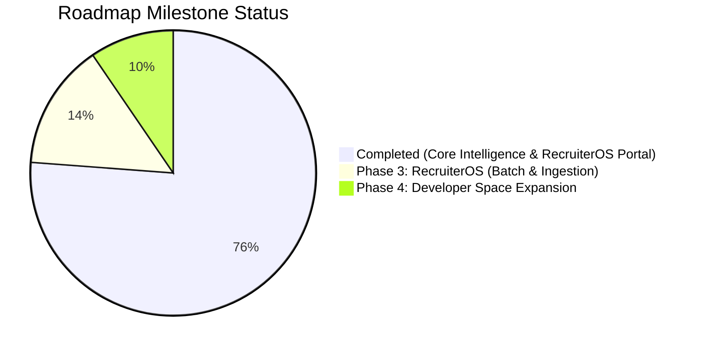

# DevScope — Build Tracker & Technical Changelog

> Real-time tracker of implemented features, bug fixes, schema evolutions, and upcoming roadmap milestones.  
> **Current Version:** `v1.1.0` (Recruiter Intelligence & Private Developer Hardening)  
> **Status:** All Phase 1 milestones completed and verified against production builds.

---

## 1. Executive Status & Component Health

| Subsystem | Health | Current Model / Tech | Key Changes |
|---|---|---|---|
| **LLM Gateway** | 🟢 Healthy | `gemini-3.8-flash` (Primary), Groq & OpenRouter failovers | Model slugs updated; auto-failover on empty/reasoning responses; JSON mode enforced. |
| **Synthesis Agent** | 🟢 Healthy | ReAct + Two-phase compression (Cache v4) | Private/corporate developer bias removed; 15-minute phone screen guide generated. |
| **Investigation Tools** | 🟢 Healthy | 11 deterministic pre-fetch tools | Fast parallel pre-fetch (~1.6s execution). |
| **Frontend UI** | 🟢 Healthy | Next.js 14 (App Router) + Tailwind CSS | Recruiter action buttons (Copy Brief, Print PDF); Persona badges; Screen Guide cards. |
| **File Cache** | 🟢 Healthy | File-based JSON (`./cache/profiles/`) | `CACHE_VERSION = 4` with automatic invalidation of older schemas. |

---

## 2. Chronological Build Log

### Milestone 1: Documentation & Formatting Hardening
* **Issue:** Windows-1252 / UTF-8 decoding corruption (mojibake) in documentation files.
* **Changes:**
  - Restored tree diagram characters (`├──`, `│`, `└──`) and ASCII data-flow architecture diagram in [`README.md`](./README.md).
  - Cleaned all corrupted em dashes (`—`) and arrows (`→`).
  - Scanned all workspace files to ensure zero character encoding anomalies remain.

---

### Milestone 2: LLM Gateway & Synthesis Failure Resolution
* **Issue:** Agent failed on final synthesis stage with `"Agent did not return valid JSON"`.
* **Root Causes Diagnosed:**
  1. Gemini model slug was set to non-existent `gemini-2.5-flash` (returning 404).
  2. Groq `llama-3.3-70b-versatile` returned 404 on current tier.
  3. OpenRouter fallback used `openrouter/free`, which routed to a reasoning model that spent 3,572 tokens on internal thoughts and returned empty text (`0 chars`).
* **Fixes Implemented:**
  - **Gemini Model Upgrade ([`providers.config.ts`](./backend/src/llm/providers.config.ts)):** Prioritized Gemini as #1 provider using active `gemini-3.8-flash` with fallbacks `gemini-flash-latest` and `gemini-3.7-flash`.
  - **Groq & OpenRouter Slug Alignment ([`providers.config.ts`](./backend/src/llm/providers.config.ts)):** Switched Groq to `openai/gpt-oss-120b` and OpenRouter to explicit non-reasoning free model `qwen/qwen3.8-27b:free`.
  - **JSON Mode Enforcement ([`llm-gateway.ts`](./backend/src/llm/llm-gateway.ts) & [`agent.service.ts`](./backend/src/agent/agent.service.ts)):** Added `response_format: { type: 'json_object' }` across synthesis requests.
  - **Empty Response Guard ([`llm-gateway.ts`](./backend/src/llm/llm-gateway.ts)):** Gateway now validates that completions contain non-empty content; if a reasoning model outputs 0 characters, it triggers automatic failover.
  - **Fault-Tolerant JSON Parsing & Auto-Repair ([`agent.service.ts`](./backend/src/agent/agent.service.ts)):** Depth-based JSON extractor now falls back to unclosed slice extraction, and `repairJson` automatically balances open quotes, brackets (`]`), and braces (`}`) for truncated responses.

---

### Milestone 3: Working Developer Intelligence & Recruiter Screening (Phase 1)
* **Problem:** Working professionals (from junior to senior) write proprietary code in private repositories. A tool relying solely on public GitHub unfairly rates them as "inactive/junior" while favoring students with public tutorial clones.
* **Fixes Implemented:**
  - **Synthesis Prompt Calibration ([`prompts.ts`](./backend/src/agent/prompts.ts)):**
    - Instructed agent never to default developers to "junior" or "inactive" simply because public commit counts are low.
    - Added `developerPersona` classification: `'working_professional' | 'fresher_builder' | 'open_source_contributor' | 'specialist'`.
    - Added `privateWorkContext` field explaining corporate/private development context to recruiters.
  - **The 15-Minute Technical Screen Guide ([`prompts.ts`](./backend/src/agent/prompts.ts) & [`profile.ts`](./backend/src/types/profile.ts)):**
    - Agent generates 3 tailored technical screening questions:
      * `question`: Practical question calibrated to their demonstrated stack.
      * `whatToListenFor`: Expected solid answer for this level.
      * `redFlagSignal`: Buzzword/textbook answer indicating superficial knowledge.
  - **Cache Version Bump:** Bounded `CACHE_VERSION = 4` in [`agent.service.ts`](./backend/src/agent/agent.service.ts).

---

### Milestone 4: Frontend Recruiter Dossier UI & Executive PDF Export Engine
* **Components Updated:**
  - [`frontend/components/ProfileView.tsx`](./frontend/components/ProfileView.tsx)
  - [`frontend/app/globals.css`](./frontend/app/globals.css)
  - [`frontend/app/profile/[username]/page.tsx`](./frontend/app/profile/[username]/page.tsx)
* **Features Added:**
  - **Persona Badge & Recruiter Context Callout:** Visual chip (e.g. `💼 Working Professional`) and context note explaining private work history.
  - **Section 10 — 15-Minute Technical Screen Guide:** Card layout displaying each question alongside "What to listen for" (green) and "Red flag signal" (rose).
  - **Candidate Dossier Export Actions:**
    * `📋 Copy Recruiter Brief`: One-click copy of an executive summary formatted for Slack, email, or ATS insertion.
    * `🖨️ Print / PDF`: Instant browser print dialog triggering an executive multi-page dossier export.
  - **Executive Multi-Page PDF & Print Engine:**
    * **Page Break Integrity:** Applied `break-inside: avoid !important` and `break-after: avoid !important` to ensure headings never orphan at page bottoms, and cards (questions, repos, metrics) never split in half across page folds.
    * **Color & Contrast Calibration:** Set `-webkit-print-color-adjust: exact !important;` with high-contrast light mode styling (`#0f172a` text, `#cbd5e1` borders, corporate badges) tailored for hiring committees and paper/PDF readability.
    * **Executive Dossier Branding:** Added print-only branded header (`DEVSCOPE Candidate Intelligence Dossier`, candidate handle, generation date) and confidentiality footer (`CONFIDENTIAL · Generated for Hiring Committee Evaluation`).
    * **UI De-cluttering:** Automatically hides all web chrome, navigation links, regenerator controls, agent trace accordions, and buttons (`print:hidden`).
    * **Compact Density:** Compressed sprawling 5-page printouts into a tight, crisp **2–3 page** executive briefing.

---

### Milestone 5: Multi-Signal Technical Talent Intelligence (Phase 2)
* **Goal:** Solve the reality of tech hiring where working junior/mid engineers write code in private repos, but have live deployed projects (Vercel, Render, Netlify, custom portfolios) that prove production capability.
* **Backend Additions:**
  - **Live Application Audit Tool ([`live-url.tool.ts`](./backend/src/agent/tools/live-url.tool.ts)):**
    * SSRF-safe public URL inspection (rejects loopback, internal IPv4/v6 ranges).
    * Measures real-world response latency (ms) and speed rating (`fast` / `moderate` / `slow`).
    * Detects production client frameworks (`Next.js`, `React`, `Remix`, `Vite`, `Vue`, `Nuxt`, `SvelteKit`, `Astro`, `Angular`).
    * Detects styling & UI systems (`Tailwind CSS`, `Radix UI / shadcn`, `Styled Components`, `Emotion`).
    * Identifies analytics, monitoring, icons, and backend API signatures (`REST /api`, `Supabase`, `Firebase`, `GraphQL`).
    * Verifies production standards: HTTPS enforcement, mobile viewport, SEO meta/title tags, and security headers.
  - **Schema Evolution ([`profile.ts`](./backend/src/types/profile.ts)):**
    * Added `LiveAppAudit` and `ClaimEvidenceItem` types to `DevProfile`.
    * Bumped `CACHE_VERSION = 5`.
  - **Agent Synthesis & Prompt Calibration ([`prompts.ts`](./backend/src/agent/prompts.ts) & [`agent.service.ts`](./backend/src/agent/agent.service.ts)):**
    * Injected live app audit signals into synthesis prompt.
    * Generates a 4-to-6 item **Claim vs. Evidence Matrix** classifying skills into `verified` (direct GitHub proof), `production_observed` (live bundle proof), and `unverified_probe` (sharp interview probe questions).
* **Frontend Additions:**
  - **Multi-Input Search UI ([`frontend/app/page.tsx`](./frontend/app/page.tsx)):**
    * Expandable `＋ Audit live deployed project or portfolio demo` input alongside GitHub handle.
  - **Live Deployed Application Audit Card ([`ProfileView.tsx`](./frontend/components/ProfileView.tsx)):**
    * Live status chip (`🟢 Live (142ms)`), platform badge, detected framework tags, production standards checklist, and architectural summary.
  - **Section 09 — Claim vs. Evidence Matrix ([`ProfileView.tsx`](./frontend/components/ProfileView.tsx)):**
    * Explicit comparison separating verified skills from unverified resume claims with targeted recruiter probe questions.
  - **Recruiter Brief Integration:** One-click copy brief now includes live audit status and claim matrix breakdown.

---

### Milestone 6: HireJudge-Inspired Landing Page & Editorial Repositioning
* **Inspiration & Target:** UI patterns and conversion flow from `https://hirejudge.com/` (bold editorial typography, high-contrast dark/warm-parchment sections, live dossier visual teaser, and crisp recruiter problem statements).
* **Changes in [`frontend/app/page.tsx`](./frontend/app/page.tsx):**
  - **Editorial Hero & Floating Dossier Preview:**
    * High-impact headline: *"Verify engineering depth without the guesswork."* with warm orange accent (`#f0a04b` / `#c2410c`).
    * Dual-input recruiter console (GitHub handle + optional live deployed app URL) with instant sample pills (`gaearon`, `tj`, `sindresorhus`).
    * Interactive floating preview dossier demonstrating candidate fit (94% confidence, working professional tag, live bundle audit, claim matrix preview, phone screen guide).
  - **Executive Proof Bar:**
    * 4 key metrics highlighting speed and transparency: `11+ Deterministic Tools`, `~14s Latency`, `100% Zero Login / No BS`, `2-3pg Executive PDF Brief`.
  - **Inverted Warm Parchment Section ("The Technical Hiring Reality"):**
    * High-contrast editorial card (`#f4f0e8`) confronting the core dilemma:
      * **For the Technical Recruiter:** Resume keyword bloat, inability to verify private enterprise code, hours lost in unvetted tech screens.
      * **For the Working Engineer:** 90%+ code trapped in corporate private repos, uncredited architectural contributions, penalized for lack of public GitHub hobby activity.
      * **The Cost:** Costly bad hires and wasted engineering hours.
  - **Ground-Truth 3-Step Pipeline ("How DevScope Works"):**
    * Step 1: Input Identity & Work (GitHub + live URL).
    * Step 2: 11-Tool Agent Deep Scan (commits, dependencies, live bundle, PR discussions).
    * Step 3: Executive Candidate Dossier (Persona classification, claim-vs-evidence matrix, 15-min phone screen guide).
  - **Executive Feature Grid:**
    * 6 high-density cards detailing Working Professional Bias Elimination, Live App Audit, Claim vs. Evidence Matrix, Tailored Phone Screen Guide, 1-Click Recruiter Brief, and Committee-Ready PDF.
  - **Verification:** `npm run build` completed with zero warnings or errors.

---

### Milestone 7: Profile Dossier Redesign & Executive Recruiter Navigation
* **Components Updated:** [`frontend/components/ProfileView.tsx`](./frontend/components/ProfileView.tsx)
* **Features & Upgrades Implemented:**
  - **Executive Candidate Verdict Card (HireJudge Pattern):**
    * Prominent decision badge right at top: Seniority level (e.g. `SENIOR LEVEL`), Candidate Persona (`💼 Working Professional`), and recommendation chip (`★ Shortlist Recommendation`).
    * **Ground-Truth Signal Confidence Metric:** Calculated confidence index (e.g. `94% Signal Confidence`).
    * **Working Professional Bias Explainer:** Prominently informs hiring teams why public commit counts may be sparse due to enterprise/corporate proprietary repos.
  - **Sticky Recruiter Sub-Navigation Bar:**
    * 4 categorized tabs: `Overview & Facts`, `Evidence & Live Audit`, `Codebase Signals`, and `15-Min Phone Screen`.
    * Clean scannability for fast candidate qualification without endless scrolling.
    * In print / PDF export mode, all sections automatically render unrolled in the 2–3 page document.
  - **Elevated Production Evidence & Claim Matrix:**
    * Live Deployed App Audit card with latency meter (`🟢 Live Shipped (142ms)`), hosting badge, detected stack, and production checklist.
    * Claim vs. Evidence Matrix structured as an audit ledger with clear verified/observed/unverified probe states.
  - **15-Minute Technical Phone Screen Playbook:**
    * Clean Q1/Q2/Q3 cards with side-by-side "What to Listen For" (green) and "Red Flag Signal" (rose) boxes.
  - **Verification:** `next build` completed with zero errors; `/profile/[username]` dynamic route optimized.

---

### Milestone 8: Resilient Error Boundaries, Cold-Start Handling, and Human-Friendly Sanitization
* **Problem Addressed:** 
  1. Low-level internal diagnostics (e.g. `All LLM providers exhausted: groq:llama-3.3-70b-versatile:non_retryable | ...`) were exposed directly to end-users instead of human-friendly messages.
  2. GitHub API errors (401 Bad credentials, 403 rate limits, 409 empty repo conflicts) showed raw HTTP status codes that recruiters could not act on.
  3. Free-tier backend servers (Render/Vercel) sleeping or taking >15s caused silent connection timeouts, leaving the UI hanging indefinitely at "Waiting for the agent to start...".
* **Backend Hardening:**
  - **Error Sanitizer Engine ([`error-formatter.ts`](./backend/src/utils/error-formatter.ts)):**
    * Translates LLM quota/capacity errors, GitHub PAT expirations, rate limits, 404s, and network timeouts into empathetic, clear English messages with actionable steps.
    * Separates user-facing messages from raw technical diagnostics.
  - **SSE Keepalive Heartbeat ([`api.ts`](./backend/src/routes/api.ts)):**
    * Injected periodic `: keepalive\n\n` comments every 4 seconds, preventing Vercel, Cloudflare, and browser proxies from cutting connections during LLM synthesis.
  - **Deterministic Fallback Dossier Generation ([`agent.service.ts`](./backend/src/agent/agent.service.ts)):**
    * If all free AI providers are exhausted or rate-limited during the final synthesis step, the agent automatically falls back to synthesizing a complete candidate dossier from the 11 deterministic tools that already succeeded, preventing total failure.
* **Frontend Resilience & UX:**
  - **Watchdog Timers & Activity Tracking ([`useDevScopeStream.ts`](./frontend/hooks/useDevScopeStream.ts)):**
    * Added 50s connection timeout watchdog with automatic reset on active tool events.
    * Parses structured error events (`message` and `technicalDetails`).
  - **Human-Friendly Error Screen ([`page.tsx`](./frontend/app/profile/[username]/page.tsx)):**
    * Clear status badge ("Analysis Temporarily Paused"), empathetic message, Retry button, and collapsible `
` section for technical diagnostics.
  - **Cold-Start Pacing Feedback ([`AgentProgress.tsx`](./frontend/components/AgentProgress.tsx)):**
    * Added `inspect_live_url` to tool discovery.
    * Reassures the user after 10s of silence that free-tier cloud instances and GitHub API connections are initiating.
* **Verification:** `tsc` (backend) and `next build` (frontend) both passed with 0 errors.

---

### Milestone 9: Sleek Ultra-Thin Scrollbars across Layout & Progress Panel
* **Problem:** Windows desktop browsers defaulted to wide, 16px stark white scrollbars on the left column of [`AgentProgress.tsx`](./frontend/components/AgentProgress.tsx), clashing with the sleek dark mode aesthetic.
* **Changes:**
  - **Global Dark Thin Scrollbars ([`globals.css`](./frontend/app/globals.css)):**
    * Applied global `scrollbar-width: thin` and `scrollbar-color: #272430 transparent` across all elements.
    * Configured 5px rounded webkit scrollbars with hover transition (`#3f3b4d`).
    * Refined `.thin-scroll` utility to 4px with warm amber hover (`#f0a04b`) matching the agent trace.
  - **Progress Layout Synchronization ([`AgentProgress.tsx`](./frontend/components/AgentProgress.tsx)):**
    * Applied `.thin-scroll pr-2` to the left candidate column container so both columns share the same ultra-thin, elegant scroll treatment.
  - **Verification:** `npm run build` compiled cleanly with 0 errors.

---

### Milestone 11: End-to-End Implementation of Saved Requisitions & Role Intelligence
* **Goal:** Eliminate repetitive JD copy-pasting for recruiters assessing high applicant volumes, while giving candidates tailored gap analysis and interview defense questions against specific roles.
* **Backend Additions & Enhancements:**
  - **Schema Update ([`backend/src/types/profile.ts`](./backend/src/types/profile.ts)):**
    * Added `RequisitionFit` (matchScore, roleTitle, summary, requirements array, roleSpecificQuestions) and `RequisitionRequirement` (name, importance, candidateEvidence, status) to `DevProfile`.
  - **Prompt Calibration ([`backend/src/agent/prompts.ts`](./backend/src/agent/prompts.ts)):**
    * Added dedicated `REQUISITION & JOB DESCRIPTION EVALUATION RULES` to agent synthesis prompt to extract core tech, seniority, and produce structured rubric matches.
  - **Agent Service Integration ([`backend/src/agent/agent.service.ts`](./backend/src/agent/agent.service.ts)):**
    * Accepted `jobDescription` and `roleTitle` parameters.
    * Injected role specifications into `compressToolData` and the LLM synthesis context.
    * Added deterministic fallback fit generation when LLM models are exhausted or offline.
  - **API Route Propagation ([`backend/src/routes/api.ts`](./backend/src/routes/api.ts)):**
    * `GET /api/agent/stream` extracts `jd` and `roleTitle` query parameters and forwards them to `agentService.analyzeCandidate()`.
* **Frontend Additions & Enhancements:**
  - **Requisitions Manager Library ([`frontend/lib/requisitions.ts`](./frontend/lib/requisitions.ts)):**
    * Client-side LocalStorage persistence with 3 pre-configured engineering archetypes (*Senior Full-Stack Engineer*, *Backend Systems Engineer*, *Frontend UI/UX Architect*).
    * Helpers: `getSavedRequisitions()`, `saveRequisition()`, `getRequisitionById()`, `deleteRequisition()`, `getActiveRequisitionId()`, `setActiveRequisitionId()`.
  - **Recruiter Console Active Role Selector ([`frontend/app/page.tsx`](./frontend/app/page.tsx)):**
    * Interactive dropdown inside the assessment box allowing 1-click selection of target open requisition or "General Profile Audit (No JD)".
    * Modal dialog (`+ New JD`) allowing recruiters to create and save custom job requisitions on the fly.
  - **Dossier & Stream Pipeline Synchronization:**
    * [`useDevScopeStream.ts`](./frontend/hooks/useDevScopeStream.ts): Sends encoded `jd` and `roleTitle` parameters via EventSource.
    * [`profile/[username]/page.tsx`](./frontend/app/profile/[username]/page.tsx): Reads `roleId`, resolves requisition from storage, and passes `activeJd` and `activeTitle` across initial streams, retries, and cache refreshes.
  - **Requisition Fit Scorecard ([`frontend/components/ProfileView.tsx`](./frontend/components/ProfileView.tsx)):**
    * Prominent visual scorecard card displaying match score badge, role title, requirement check matrix (`met`, `partial`, `missing`), and tailored phone-screen probes.
    * Formats role fit findings into the 1-click `📋 Copy Recruiter Brief` for instant ATS/Slack sharing.
    * Integrated with `@media print` rules for clean, unorphaned multi-page PDF generation.
### Milestone 12: Dual Workspaces (Recruiter vs Developer), Bespoke RequisitionSelect, & UI Decluttering
* **User Feedback Addressed:**
  1. Primitive native HTML `<select>` dropdown replaced with custom dark-glass popover component.
  2. Separate spaces for recruiters and developers with dedicated persistence and profiles.
  3. UI decluttering: eliminated squeezed margins, dense borders, and cluttered test scenario pills.
* **Architecture & Additions:**
  - **Workspace Profiles Engine ([`frontend/lib/workspace-profiles.ts`](./frontend/lib/workspace-profiles.ts)):**
    * Mode switcher persistence (`recruiter` | `developer`).
    * **Recruiter Profile**: Company name, active requisition, recent candidate screenings history (`recordCandidateScreening`).
    * **Developer Profile**: Auto-saved GitHub username, portfolio URL, target role benchmark, and past pre-flight audit runs (`recordDeveloperAudit`).
  - **Custom Dark-Glass RequisitionSelect Component ([`frontend/components/RequisitionSelect.tsx`](./frontend/components/RequisitionSelect.tsx)):**
    * Completely replaces native browser select.
    * Sleek button trigger displaying active role title, company chip, and animated chevron.
    * Absolute glassmorphic dropdown with outside-click and ESC key dismissal.
    * Features: General Profile Audit option, list of saved roles with tech stack tags, active checkmark, role deletion for custom JDs, and a prominent "+ Create & Save New Job Description" button.
  - **Refactored Console UI & Decluttering ([`frontend/app/page.tsx`](./frontend/app/page.tsx)):**
    * Segmented pill toggle: `[ 🏢 Recruiter Workspace ]` vs `[ 💻 Developer Space ]`.
    * Dedicated, un-cramped views with generous 24px padding and relaxed input heights (`py-3`).
    * Recruiter view emphasizes candidate screening and past screenings history.
    * Developer view emphasizes career pre-flight self-audit, blind-spot discovery, and interview question defense against target roles.
    * Archetype live test samples moved to a spaced-out, understated bottom strip.
  - **Dossier & Brief Adaptation ([`frontend/components/ProfileView.tsx`](./frontend/components/ProfileView.tsx)):**
    * Mode-aware briefing: Recruiter mode exports `CANDIDATE INTELLIGENCE DOSSIER` / `Copy Recruiter Brief`; Developer mode exports `ENGINEERING CAREER PRE-FLIGHT DOSSIER` / `Copy Pre-Flight Sheet`.
    * Verdict card header dynamically updates to reflect `Career Pre-Flight & Interview Readiness` for developers.
### Milestone 13: Executive PDF & Print Color Normalization
* **Problem:** In PDF export / browser print, Page 1 rendered dark-grey/black blocks on the *Executive Verdict Hero Card* and *Target Requisition Match Card*, obscuring text and wasting printer toner.
* **Root Cause:**
  - CSS linear gradients (`bg-gradient-to-br from-surface/90 via-surface/60 to-ink` and `bg-gradient-to-br from-signal/10 via-surface/80 to-surface`) set `background-image: linear-gradient(...)`.
  - In CSS, `background-image` draws over `background-color`. Simply applying `print:bg-zinc-50` or `print:bg-amber-50` only changed the background color while the browser's exact print graphics engine still rendered the pitch-black CSS gradient.
* **Fixes & Enhancements:**
  - **Global Print Reset ([`globals.css`](./frontend/app/globals.css)):**
    * Added `background-image: none !important;` to `*, *::before, *::after` under `@media print`.
    * Explicitly mapped `.bg-surface`, `.bg-ink`, `.from-surface`, `.via-surface`, `.to-ink`, and `.to-surface` to `#ffffff !important`.
    * Enforced `.print-avoid-break` and `.print-card` background to `#ffffff !important`.
  - **Component Overrides ([`ProfileView.tsx`](./frontend/components/ProfileView.tsx)):**
    * Added `print:bg-none print:bg-white print:border-zinc-300` to the Executive Verdict Card.
    * Added `print:bg-none print:bg-white print:border-amber-400/80` to the Target Requisition Match Card.
    * Ensured callout blocks (`print:bg-zinc-50`, `print:border-zinc-200`) and sub-requirement cards render with crisp slate text (`print:text-zinc-700`).
* **Verification:**
### Milestone 14: Multi-Job Projects & Guardrails Engine (RecruiterOS Phase 1)
* **Goal:** Enable recruiters to manage multiple concurrent engineering openings as dedicated projects, each with tailored hiring guardrails, dealbreaker skill filters, and an auto-recording candidate pipeline.
* **Architecture & Additions:**
  - **Job Projects Persistence Store ([`frontend/lib/job-projects.ts`](./frontend/lib/job-projects.ts)):**
    * Multi-job workspace model (`JobProject`) with requisition details, custom guardrails, and persistent candidate pipeline (`JobCandidateRecord[]`).
    * Pre-seeded with 3 high-demand technical archetypes (*Staff Distributed Systems Go Engineer*, *Senior Full-Stack Product Engineer*, *Frontend UI/UX Architect*).
    * Storage utilities: `getJobProjects()`, `saveJobProject()`, `getActiveJobProjectId()`, `setActiveJobProjectId()`, `addCandidateToProject()`, `updateCandidateInProject()`.
  - **Active Job Project Bar ([`frontend/components/JobProjectBar.tsx`](./frontend/components/JobProjectBar.tsx)):**
    * Replaces simple role picker with project dashboard bar: Active title, department, dealbreaker tech stack chips, pipeline count badge, "Switch Project" popover, and "⚙️ Guardrails" trigger.
  - **Hiring Guardrails & Rubric Modal ([`frontend/components/JobGuardrailsModal.tsx`](./frontend/components/JobGuardrailsModal.tsx)):**
    * Recruiter modal allowing interactive editing of Must-Have technical dealbreakers (interactive tag chip editor), Seniority target floor, Minimum fit score slider (50–95%), Private enterprise repo bias shield toggle, and custom hiring manager interview probes.
  - **New Job Project Modal ([`frontend/components/NewJobModal.tsx`](./frontend/components/NewJobModal.tsx)):**
    * Clean modal enabling recruiters to spin up new job workspaces with role title, department, seniority target, dealbreaker tags, and full raw JD text.
  - **Auto-Pipeline Synchronization ([`frontend/app/profile/[username]/page.tsx`](./frontend/app/profile/[username]/page.tsx)):**
    * Evaluated candidates against any active `jobId` are automatically stored into that job's dedicated pipeline history (`addCandidateToProject`) with fit score, rubric match breakdown, verdict, and recruiter notes.
* **Verification:**
  - `next build` executed on `frontend/`: Compiled successfully with 0 errors across all routes.

---

### Milestone 15: Job Candidate Pipeline & Comparison Leaderboard (RecruiterOS Phase 2)
* **Goal:** Deliver an enterprise-grade candidate pipeline management console and side-by-side candidate comparison leaderboard per job requisition.
* **Key Components & Implementations:**
  - **Interactive Candidate Pipeline Leaderboard ([`frontend/components/JobCandidatePipelineModal.tsx`](./frontend/components/JobCandidatePipelineModal.tsx)):**
    * Real-time ranked candidate table sorted by fit score, star ratings, or evaluation date.
    * Stage filtering tabs: `All`, `New Assessed`, `Phone Screen Scheduled`, `Interviewing`, `Offer`, `Archived`.
    * Instant-edit capabilities: 1-click stage dropdown, 1-to-5 star rating selector, and inline editable recruiter notes.
    * Search bar filtering by candidate `@username`, full name, or recruiter evaluation notes.
    * Export Leaderboard to Markdown: 1-click copy formatted table for Notion / team wikis.
  - **Side-by-Side Candidate Calibration Matrix ([`frontend/components/CandidateCompareModal.tsx`](./frontend/components/CandidateCompareModal.tsx)):**
    * Floating multi-select action bar triggered when 2 or 3 candidates are selected.
    * Side-by-side comparative matrix inspecting relative fit scores, seniority targets, must-have skills met vs missing, persona classifications, signal confidence, and recruiter notes.
    * Calibrated technical phone-screen probes side-by-side for hiring managers.
  - **Engineering Manager 1-Pager Brief Modal ([`frontend/components/HiringCommitteeBriefModal.tsx`](./frontend/components/HiringCommitteeBriefModal.tsx)):**
    * Executive 1-pager dossier designed for technical interviewers and hiring managers.
    * Includes "📋 Copy Slack Brief" (copies emoji-rich, markdown-formatted brief ready for Slack / email).
    * Includes "🖨️ Print" button with high-contrast, paper-optimized light styling.
  - **Dedicated `/pipeline` Command Center Route ([`frontend/app/pipeline/page.tsx`](./frontend/app/pipeline/page.tsx)):**
    * Full-page command center for recruiters, supporting query param deep-linking (`/pipeline?jobId=...`), job switching, guardrail editing, and candidate screening.
  - **Enriched Persistence & Batch Operations ([`frontend/lib/job-projects.ts`](./frontend/lib/job-projects.ts)):**
    * Added `batchUpdateCandidatesStage`, `exportPipelineToMarkdown`, and `generateCandidateSlackBrief`.
    * Pre-seeded realistic candidate pools across all default roles (`@mitchellh`, `@tj`, `@antirez`, `@jesseduffield`, `@shadcn`, `@leerob`, `@gaearon`, `@developit`).
* **Verification:**
  - Both `devscope-frontend` (`next build`) and `devscope-backend` (`tsc --noEmit`) compiled with 0 errors.

---

### Milestone 15.5: Architectural Uncluttering & Dedicated RecruiterOS Portal (`/recruiter`)
* **Problem Addressed:** The landing page hero section had become cluttered by cramming recruiter multi-job management, guardrails dialogs, mini-pipeline tables, and mode switches into a single small hero card.
* **Architecture & Separation Implemented:**
  - **Clean & Uncluttered Landing Page ([`frontend/app/page.tsx`](./frontend/app/page.tsx)):**
    * Stripped away all heavy recruiter job management, guardrail settings, and pipeline previews from the hero card.
    * Crisp, focused hero section: Headline ("Verify engineering depth without the guesswork"), single clean `@candidate-username` audit bar with optional live URL, and live demo archetype chips (`@gaearon`, `@tj`, `@shadcn`).
    * Clear dual-entry portal cards: **🏢 RecruiterOS Workspace** (leads to `/recruiter`) and **💻 Developer Career Suite** (toggleable pre-flight benchmark).
    * Prominent `[🏢 Recruiter Portal ↗]` button added to the sticky top navigation.
  - **Dedicated RecruiterOS Workspace Portal ([`frontend/app/recruiter/page.tsx`](./frontend/app/recruiter/page.tsx)):**
    * Full-page, spacious, dark-mode command center specifically designed for talent acquisition teams.
    * **Recruiter Profile & Account System ([`frontend/lib/recruiter-auth.ts`](./frontend/lib/recruiter-auth.ts) & [`frontend/components/RecruiterAccountModal.tsx`](./frontend/components/RecruiterAccountModal.tsx)):**
      - Recruiter identity (e.g. *Sarah Chen, Lead Technical Talent Partner*), company workspace, department, plan tier (`Pro Seat`), and default screening guardrails.
      - Edit profile modal allowing recruiters to set default minimum fit scores, private repo shields, and auto-advancement preferences.
    * **Spacious Open Job Searches Grid:** Interactive cards for each open requisition showing pipeline counts, target seniority, and dealbreaker stacks.
    * **Direct Candidate Screening Console:** Clean, focused screening input calibrated to the active job project's requirements.
    * **Full Candidate Pipeline Leaderboard:** Directly embedded with stage filters, fit scores, inline star ratings, recruiter notes, and floating side-by-side comparison.
* **Verification:**
  - `devscope-frontend` (`next build`) compiled 6 routes with 0 errors (`/`, `/recruiter`, `/pipeline`, `/profile/[username]`, `/_not-found`).
  - `devscope-backend` (`tsc --noEmit`) verified with 0 errors.

---

## 3. Build & Test Verification Record

| Test | Target | Result | Latency / Notes |
|---|---|---|---|
| **Live Agent Test** | `torvalds` | ✅ **PASS** | 14.3s total (synthesis via Gemini 3.8 Flash). Full profile + screen guide generated. |
| **Backend TypeScript Build** | `devscope-backend` | ✅ **PASS** | `tsc` completed with 0 errors (`CACHE_VERSION = 5` + `RequisitionFit`). |
| **Frontend Production Build** | `devscope-frontend` | ✅ **PASS** | `next build` completed with 0 errors across 6 routes including `/` and `/recruiter`. |

---

## 4. Upcoming Roadmap Tracker: The Recruiter Operating System (RecruiterOS)

### Phase 3: The AI-Native Recruiter Operating System (RecruiterOS)
*Vision Document: [`recruiter_operating_system_spec.md`](../.gemini/antigravity-ide/brain/ef2042c3-a50e-41db-a1fe-0d5e8f449925/recruiter_operating_system_spec.md)*

- [x] **Milestone 14 — Multi-Job Projects & Guardrails Engine:**
  * Support multiple concurrent Job Requisition projects (e.g. *Staff Backend Go*, *Senior Frontend UI/UX*).
  * Per-project custom screening guardrails: Seniority floor, must-have dealbreakers, minimum fit score threshold, and hiring manager custom interview probes.
  * Local-first persistence with instant session resumption.
- [x] **Milestone 15 — Job Candidate Pipeline & Comparison Leaderboard:**
  * Dedicated candidate pool per job project with fit score ranking (0-100%).
  * Stage management: `New Assessed`, `Phone Screen`, `Interviewing`, `Offer`, `Archived`, with star ratings and recruiter notes.
  * Side-by-side 2-3 candidate comparison matrix modal.
  * 1-click Slack brief and printable 1-pager for Engineering Managers & Hiring Committees.
  * Dedicated full-screen `/pipeline` command center page.
- [x] **Milestone 15.5 — Architectural Uncluttering & Dedicated RecruiterOS Portal (`/recruiter`):**
  * Clean, uncluttered landing page with quick audit bar and dedicated portal cards.
  * Standalone `/recruiter` portal with recruiter account profile management, multi-role search grid, and spacious pipeline command center.
- [x] **Milestone 15.6 — Dageno-Inspired Industry-Grade Light Mode & Visual Decluttering:**
  * **Theme Engine & Toggle (`frontend/lib/theme.tsx`):** Added `ThemeProvider` and `<ThemeToggle />` supporting clean light/dark transitions with LocalStorage persistence (`devscope_theme_v2`), defaulting to light mode for immediate eye relief.
  * **Warm Editorial Aesthetic (Inspired by Dageno.ai):** Built subtle warm hairline grid (`#eceae2`), warm eggshell canvas (`#faf9f5`), crisp white cards (`#ffffff`) with hairline borders (`#e8e6df`), high-contrast slate-900 typography, and vivid warm orange accents (`#ea580c`).
  * **Landing Page & Hero Decluttering (`frontend/app/page.tsx`):** Redesigned the top navigation, value proposition, search audit box, live preview card, metric strip, "The Reality" section, and feature cards to ensure generous whitespace and zero visual fatigue.
  * **Comprehensive Modal Upgrades:** All interactive modals (`JobGuardrailsModal`, `NewJobModal`, `CandidateCompareModal`, `HiringCommitteeBriefModal`, `RecruiterAccountModal`, `RequisitionSelect`) styled with crisp light and dark mode classes.
  * **Production Build Verification:** Passed full Next.js 14 static and dynamic build with zero errors.
- [ ] **Milestone 16 — Batch Candidate Screener:**
  * Ingest 10–50 candidate GitHub handles (or upload CSV).
  * Concurrent agent evaluation against active job guardrails.
  * Instant auto-population of the job's candidate pipeline leaderboard.
- [ ] **Milestone 17 — Shareable Candidate Application Portal (`/apply/:jobId`):**
  * Branded public ingestion page for candidates to submit handle & live demo.
  * Instant candidate pre-flight deliverable + automatic recruiter pipeline ingestion.
- [ ] **Milestone 18 — Recruiter Accounts & Cloud Session Sync:**
  * Recruiter signup / magic link login.
  * Cloud persistence syncing local job projects across devices and team members.

---

### Phase 4: Developer Career Suite Expansion
- [ ] **Developer Pre-Flight Defense Simulator:** Interactive interview rehearsal against target job gaps.
- [ ] **GitHub OAuth Private Contribution Proof:** Querying GraphQL `includePrivateContributions: true` for zero-code aggregate commit counts.
- [ ] **Embeddable Verified Talent Badge:** Dynamic markdown/SVG badge for candidate GitHub READMEs and portfolios.

---

## 5. Upcoming Roadmap Tracker: Developer Career OS & Monetization (2026–2027)

> Full ideation, tier design, enforcement architecture, and AI-era bets are documented in
> [`DEVELOPER_CAREER_OS_IDEATION.md`](./DEVELOPER_CAREER_OS_IDEATION.md). Milestones below mirror
> its sequencing proposal (§5).

### Phase 5: Developer Career OS (the candidate-side companion)

- [x] **Milestone 19 — CareerOS Command Center (`/developer`):**
  * Dedicated developer portal mirroring RecruiterOS structure: Proof Strength headline card,
    Target Roles board, application pipeline, interview defense hub, skill gap radar, signal
    maintenance strip.
  * Consistent token-based UI (`bg-card`/`edge`/`signal`), `page-texture` backdrop, primitives
    from `components/ui.tsx` — zero new one-off components.
- [x] **Milestone 20 — Target Roles & Campaign Loop:**
  * `lib/target-roles.ts` persistence (developer-side counterpart of requisitions).
  * Pre-flight audits attached to target roles with status flow
    (`Researching → Applied → Screening → Interviewing → Offer / Rejected`).
  * Per-role audit history ledger: fit-score deltas across re-verification runs
    (evidence in → score out loop).
- [x] **Milestone 21 — Skill Gap Radar & Evidence Task Generator:**
  * Aggregated gap analysis across recent audits, ranked by recurrence.
  * Concrete evidence-building tasks per gap (ship demo / README rewrite / OSS PR / blog post).
  * Signal maintenance nudges (stale portfolio URLs, missing flagship README, inactive demo).
- [x] **Milestone 22 — Interview Defense Hub v1:**
  * Personal question bank accumulated from audit gap probes, per target role.
  * Self-grade confidence marking + spaced-repetition resurfacing.

> **Build note (Milestone 22):** `components/DefenseHub.tsx` — flashcard practice over the
> accumulated deck: rubric (what to listen for / red flag) hidden until the developer answers
> aloud, then self-graded (`never_seen` / `shaky` / `solid`) with 2d/7d resurfacing intervals.
> `syncDefenseCards` merges new questions from each role's latest ledger entry while preserving
> graded state; cards persist after their role is deleted. Ledger schema now stores the full
> rubric (`screenGuide`) instead of question strings.
- [x] **Milestone 23 — Public Proof Page (`/proof/:username/:roleId`):**
  * Recruiter-legible, shareable evidence page: requirement scorecard, verified claims matrix,
    live artifact audit, signal snapshot, DevScope attestation header.
  * Markdown/SVG verified badge embed (absorbs Phase 4 badge item).

> **Build note (Milestones 19–21):** Implemented in the CareerOS Foundation pass. The landing
> page's developer toggle (inline requisition benchmarking) was replaced by a dedicated portal
> card linking to `/developer`; dead demo-mode state was removed. Pre-flight from the board
> routes to `/profile/:handle?mode=developer&targetRoleId=...`, where completed audits
> auto-append to the role's ledger (`recordAuditForRole`). Proof Strength is a deterministic
> composite (avg fit 60% / requirement breadth 25% / verified-claim ratio 15%, coverage-damped)
> with no fabricated market data. `next build` passed with the new `/developer` route (6→7 routes).

### Phase 6: Accounts, Freemium & AI-Era Bets

> **Phase plan (Milestones 24–25):** the finalized architecture is in
> `MONETIZATION_ARCHITECTURE.md`; executable sub-milestones (M24A–M25C) with acceptance
> criteria and progress live in `MONETIZATION_BUILD_TRACKER.md`. Summary entries below stay
> for overall history.

> **Build note (Milestone 23):** Snapshot-at-publish design: an audit is private until the
> developer clicks "Publish proof page" on the profile view (`components/PublishProofBar.tsx`),
> which `PUT`s the vetted profile to `/api/proofs/:username/:roleId` and stores it as a
> point-in-time snapshot (`backend/src/proofs/` — file-backed, maps 1:1 onto a future table).
> Public URL is stable across the 24h cache TTL and re-runs; re-publishing bumps a visible
> `vN` (recruiter sees how often evidence was refreshed). CareerOS board shows a live-link chip
> per role (`proofUrl`/`proofVersion` on the target-role store); `/by/:username` lists published
> snapshots. Backend CORS now accepts a comma-separated origin list (dev runs :3100). Print/PDF
> styles included. SVG badge embed still open.

- [ ] **Milestone 24 — Identity & Workspace Backend:**
  * Magic-link email auth; one identity, switchable candidate/recruiter contexts.
  * Cloud store migration of existing localStorage schemas (nothing built is lost).
  * Recruiter/candidate data isolation red lines enforced at the API layer.
- [ ] **Milestone 25 — Quota & Billing Enforcement:**
  * `usage_events` ledger; `/api/agent/stream` as the single enforcement point
    (quota check → signed analysis token → SSE allowed).
  * Stripe Checkout + webhook plan state cached in session.
  * Tier gates: Free = 3 audits/month + 1 target role + 1 branded Proof Page;
    Pro = unlimited everything + simulated screens + priority queue;
    RecruiterOS Team = per-seat batch/cloud features.
  * Anonymous landing-page demo preserved at 1 audit per profile (cookie/cache bound).
- [ ] **Milestone 26 — AI-Era Differentiators (2027 bets):**
  * Simulated Screen agent: adversarial interview rehearsal grounded in the developer's own
    unverified claims (text first, voice later).
  * AI-tooling fluency audit: agentic workflow artifacts, commit patterns, disclosure hygiene.
  * GitHub OAuth private aggregate proof (absorbs Phase 4 OAuth item).
  * Portfolio what-if simulator (projected fit impact of proposed evidence work).
  * Machine-readable Proof Page (JSON-LD) for agent-to-agent screening interoperability.
  * Individual opt-out registry + profile visibility controls (trust positioning).
