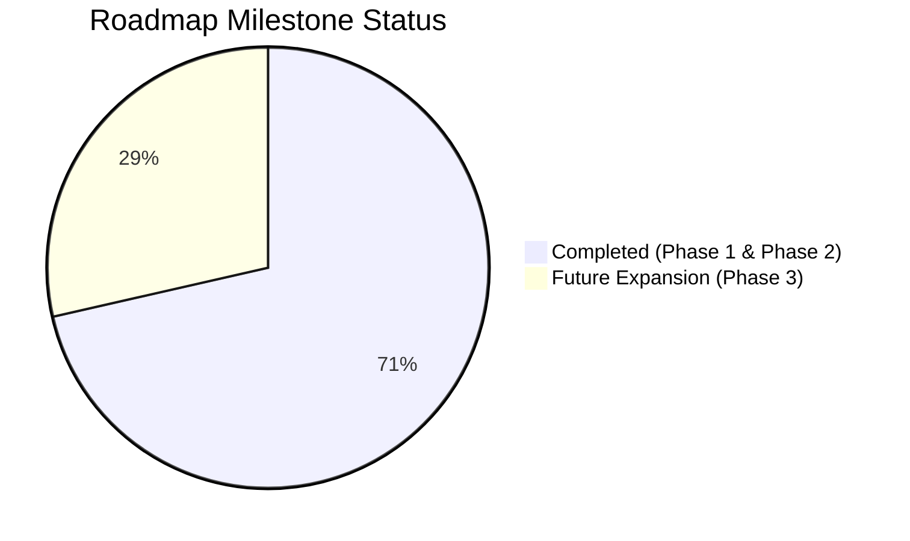

# DevScope — Build Tracker & Technical Changelog

> Real-time tracker of implemented features, bug fixes, schema evolutions, and upcoming roadmap milestones.  
> **Current Version:** `v1.1.0` (Recruiter Intelligence & Private Developer Hardening)  
> **Status:** All Phase 1 milestones completed and verified against production builds.

---

## 1. Executive Status & Component Health

| Subsystem | Health | Current Model / Tech | Key Changes |
|---|---|---|---|
| **LLM Gateway** | 🟢 Healthy | `gemini-3.8-flash` (Primary), Groq & OpenRouter failovers | Model slugs updated; auto-failover on empty/reasoning responses; JSON mode enforced. |
| **Synthesis Agent** | 🟢 Healthy | ReAct + Two-phase compression (Cache v4) | Private/corporate developer bias removed; 15-minute phone screen guide generated. |
| **Investigation Tools** | 🟢 Healthy | 11 deterministic pre-fetch tools | Fast parallel pre-fetch (~1.6s execution). |
| **Frontend UI** | 🟢 Healthy | Next.js 14 (App Router) + Tailwind CSS | Recruiter action buttons (Copy Brief, Print PDF); Persona badges; Screen Guide cards. |
| **File Cache** | 🟢 Healthy | File-based JSON (`./cache/profiles/`) | `CACHE_VERSION = 4` with automatic invalidation of older schemas. |

---

## 2. Chronological Build Log

### Milestone 1: Documentation & Formatting Hardening
* **Issue:** Windows-1252 / UTF-8 decoding corruption (mojibake) in documentation files.
* **Changes:**
  - Restored tree diagram characters (`├──`, `│`, `└──`) and ASCII data-flow architecture diagram in [`README.md`](./README.md).
  - Cleaned all corrupted em dashes (`—`) and arrows (`→`).
  - Scanned all workspace files to ensure zero character encoding anomalies remain.

---

### Milestone 2: LLM Gateway & Synthesis Failure Resolution
* **Issue:** Agent failed on final synthesis stage with `"Agent did not return valid JSON"`.
* **Root Causes Diagnosed:**
  1. Gemini model slug was set to non-existent `gemini-2.5-flash` (returning 404).
  2. Groq `llama-3.3-70b-versatile` returned 404 on current tier.
  3. OpenRouter fallback used `openrouter/free`, which routed to a reasoning model that spent 3,572 tokens on internal thoughts and returned empty text (`0 chars`).
* **Fixes Implemented:**
  - **Gemini Model Upgrade ([`providers.config.ts`](./backend/src/llm/providers.config.ts)):** Prioritized Gemini as #1 provider using active `gemini-3.8-flash` with fallbacks `gemini-flash-latest` and `gemini-3.7-flash`.
  - **Groq & OpenRouter Slug Alignment ([`providers.config.ts`](./backend/src/llm/providers.config.ts)):** Switched Groq to `openai/gpt-oss-120b` and OpenRouter to explicit non-reasoning free model `qwen/qwen3.8-27b:free`.
  - **JSON Mode Enforcement ([`llm-gateway.ts`](./backend/src/llm/llm-gateway.ts) & [`agent.service.ts`](./backend/src/agent/agent.service.ts)):** Added `response_format: { type: 'json_object' }` across synthesis requests.
  - **Empty Response Guard ([`llm-gateway.ts`](./backend/src/llm/llm-gateway.ts)):** Gateway now validates that completions contain non-empty content; if a reasoning model outputs 0 characters, it triggers automatic failover.
  - **Fault-Tolerant JSON Parsing & Auto-Repair ([`agent.service.ts`](./backend/src/agent/agent.service.ts)):** Depth-based JSON extractor now falls back to unclosed slice extraction, and `repairJson` automatically balances open quotes, brackets (`]`), and braces (`}`) for truncated responses.

---

### Milestone 3: Working Developer Intelligence & Recruiter Screening (Phase 1)
* **Problem:** Working professionals (from junior to senior) write proprietary code in private repositories. A tool relying solely on public GitHub unfairly rates them as "inactive/junior" while favoring students with public tutorial clones.
* **Fixes Implemented:**
  - **Synthesis Prompt Calibration ([`prompts.ts`](./backend/src/agent/prompts.ts)):**
    - Instructed agent never to default developers to "junior" or "inactive" simply because public commit counts are low.
    - Added `developerPersona` classification: `'working_professional' | 'fresher_builder' | 'open_source_contributor' | 'specialist'`.
    - Added `privateWorkContext` field explaining corporate/private development context to recruiters.
  - **The 15-Minute Technical Screen Guide ([`prompts.ts`](./backend/src/agent/prompts.ts) & [`profile.ts`](./backend/src/types/profile.ts)):**
    - Agent generates 3 tailored technical screening questions:
      * `question`: Practical question calibrated to their demonstrated stack.
      * `whatToListenFor`: Expected solid answer for this level.
      * `redFlagSignal`: Buzzword/textbook answer indicating superficial knowledge.
  - **Cache Version Bump:** Bounded `CACHE_VERSION = 4` in [`agent.service.ts`](./backend/src/agent/agent.service.ts).

---

### Milestone 4: Frontend Recruiter Dossier UI & Executive PDF Export Engine
* **Components Updated:**
  - [`frontend/components/ProfileView.tsx`](./frontend/components/ProfileView.tsx)
  - [`frontend/app/globals.css`](./frontend/app/globals.css)
  - [`frontend/app/profile/[username]/page.tsx`](./frontend/app/profile/[username]/page.tsx)
* **Features Added:**
  - **Persona Badge & Recruiter Context Callout:** Visual chip (e.g. `💼 Working Professional`) and context note explaining private work history.
  - **Section 10 — 15-Minute Technical Screen Guide:** Card layout displaying each question alongside "What to listen for" (green) and "Red flag signal" (rose).
  - **Candidate Dossier Export Actions:**
    * `📋 Copy Recruiter Brief`: One-click copy of an executive summary formatted for Slack, email, or ATS insertion.
    * `🖨️ Print / PDF`: Instant browser print dialog triggering an executive multi-page dossier export.
  - **Executive Multi-Page PDF & Print Engine:**
    * **Page Break Integrity:** Applied `break-inside: avoid !important` and `break-after: avoid !important` to ensure headings never orphan at page bottoms, and cards (questions, repos, metrics) never split in half across page folds.
    * **Color & Contrast Calibration:** Set `-webkit-print-color-adjust: exact !important;` with high-contrast light mode styling (`#0f172a` text, `#cbd5e1` borders, corporate badges) tailored for hiring committees and paper/PDF readability.
    * **Executive Dossier Branding:** Added print-only branded header (`DEVSCOPE Candidate Intelligence Dossier`, candidate handle, generation date) and confidentiality footer (`CONFIDENTIAL · Generated for Hiring Committee Evaluation`).
    * **UI De-cluttering:** Automatically hides all web chrome, navigation links, regenerator controls, agent trace accordions, and buttons (`print:hidden`).
    * **Compact Density:** Compressed sprawling 5-page printouts into a tight, crisp **2–3 page** executive briefing.

---

### Milestone 5: Multi-Signal Technical Talent Intelligence (Phase 2)
* **Goal:** Solve the reality of tech hiring where working junior/mid engineers write code in private repos, but have live deployed projects (Vercel, Render, Netlify, custom portfolios) that prove production capability.
* **Backend Additions:**
  - **Live Application Audit Tool ([`live-url.tool.ts`](./backend/src/agent/tools/live-url.tool.ts)):**
    * SSRF-safe public URL inspection (rejects loopback, internal IPv4/v6 ranges).
    * Measures real-world response latency (ms) and speed rating (`fast` / `moderate` / `slow`).
    * Detects production client frameworks (`Next.js`, `React`, `Remix`, `Vite`, `Vue`, `Nuxt`, `SvelteKit`, `Astro`, `Angular`).
    * Detects styling & UI systems (`Tailwind CSS`, `Radix UI / shadcn`, `Styled Components`, `Emotion`).
    * Identifies analytics, monitoring, icons, and backend API signatures (`REST /api`, `Supabase`, `Firebase`, `GraphQL`).
    * Verifies production standards: HTTPS enforcement, mobile viewport, SEO meta/title tags, and security headers.
  - **Schema Evolution ([`profile.ts`](./backend/src/types/profile.ts)):**
    * Added `LiveAppAudit` and `ClaimEvidenceItem` types to `DevProfile`.
    * Bumped `CACHE_VERSION = 5`.
  - **Agent Synthesis & Prompt Calibration ([`prompts.ts`](./backend/src/agent/prompts.ts) & [`agent.service.ts`](./backend/src/agent/agent.service.ts)):**
    * Injected live app audit signals into synthesis prompt.
    * Generates a 4-to-6 item **Claim vs. Evidence Matrix** classifying skills into `verified` (direct GitHub proof), `production_observed` (live bundle proof), and `unverified_probe` (sharp interview probe questions).
* **Frontend Additions:**
  - **Multi-Input Search UI ([`frontend/app/page.tsx`](./frontend/app/page.tsx)):**
    * Expandable `＋ Audit live deployed project or portfolio demo` input alongside GitHub handle.
  - **Live Deployed Application Audit Card ([`ProfileView.tsx`](./frontend/components/ProfileView.tsx)):**
    * Live status chip (`🟢 Live (142ms)`), platform badge, detected framework tags, production standards checklist, and architectural summary.
  - **Section 09 — Claim vs. Evidence Matrix ([`ProfileView.tsx`](./frontend/components/ProfileView.tsx)):**
    * Explicit comparison separating verified skills from unverified resume claims with targeted recruiter probe questions.
  - **Recruiter Brief Integration:** One-click copy brief now includes live audit status and claim matrix breakdown.

---

### Milestone 6: HireJudge-Inspired Landing Page & Editorial Repositioning
* **Inspiration & Target:** UI patterns and conversion flow from `https://hirejudge.com/` (bold editorial typography, high-contrast dark/warm-parchment sections, live dossier visual teaser, and crisp recruiter problem statements).
* **Changes in [`frontend/app/page.tsx`](./frontend/app/page.tsx):**
  - **Editorial Hero & Floating Dossier Preview:**
    * High-impact headline: *"Verify engineering depth without the guesswork."* with warm orange accent (`#f0a04b` / `#c2410c`).
    * Dual-input recruiter console (GitHub handle + optional live deployed app URL) with instant sample pills (`gaearon`, `tj`, `sindresorhus`).
    * Interactive floating preview dossier demonstrating candidate fit (94% confidence, working professional tag, live bundle audit, claim matrix preview, phone screen guide).
  - **Executive Proof Bar:**
    * 4 key metrics highlighting speed and transparency: `11+ Deterministic Tools`, `~14s Latency`, `100% Zero Login / No BS`, `2-3pg Executive PDF Brief`.
  - **Inverted Warm Parchment Section ("The Technical Hiring Reality"):**
    * High-contrast editorial card (`#f4f0e8`) confronting the core dilemma:
      * **For the Technical Recruiter:** Resume keyword bloat, inability to verify private enterprise code, hours lost in unvetted tech screens.
      * **For the Working Engineer:** 90%+ code trapped in corporate private repos, uncredited architectural contributions, penalized for lack of public GitHub hobby activity.
      * **The Cost:** Costly bad hires and wasted engineering hours.
  - **Ground-Truth 3-Step Pipeline ("How DevScope Works"):**
    * Step 1: Input Identity & Work (GitHub + live URL).
    * Step 2: 11-Tool Agent Deep Scan (commits, dependencies, live bundle, PR discussions).
    * Step 3: Executive Candidate Dossier (Persona classification, claim-vs-evidence matrix, 15-min phone screen guide).
  - **Executive Feature Grid:**
    * 6 high-density cards detailing Working Professional Bias Elimination, Live App Audit, Claim vs. Evidence Matrix, Tailored Phone Screen Guide, 1-Click Recruiter Brief, and Committee-Ready PDF.
  - **Verification:** `npm run build` completed with zero warnings or errors.

---

### Milestone 7: Profile Dossier Redesign & Executive Recruiter Navigation
* **Components Updated:** [`frontend/components/ProfileView.tsx`](./frontend/components/ProfileView.tsx)
* **Features & Upgrades Implemented:**
  - **Executive Candidate Verdict Card (HireJudge Pattern):**
    * Prominent decision badge right at top: Seniority level (e.g. `SENIOR LEVEL`), Candidate Persona (`💼 Working Professional`), and recommendation chip (`★ Shortlist Recommendation`).
    * **Ground-Truth Signal Confidence Metric:** Calculated confidence index (e.g. `94% Signal Confidence`).
    * **Working Professional Bias Explainer:** Prominently informs hiring teams why public commit counts may be sparse due to enterprise/corporate proprietary repos.
  - **Sticky Recruiter Sub-Navigation Bar:**
    * 4 categorized tabs: `Overview & Facts`, `Evidence & Live Audit`, `Codebase Signals`, and `15-Min Phone Screen`.
    * Clean scannability for fast candidate qualification without endless scrolling.
    * In print / PDF export mode, all sections automatically render unrolled in the 2–3 page document.
  - **Elevated Production Evidence & Claim Matrix:**
    * Live Deployed App Audit card with latency meter (`🟢 Live Shipped (142ms)`), hosting badge, detected stack, and production checklist.
    * Claim vs. Evidence Matrix structured as an audit ledger with clear verified/observed/unverified probe states.
  - **15-Minute Technical Phone Screen Playbook:**
    * Clean Q1/Q2/Q3 cards with side-by-side "What to Listen For" (green) and "Red Flag Signal" (rose) boxes.
  - **Verification:** `next build` completed with zero errors; `/profile/[username]` dynamic route optimized.

---

### Milestone 8: Resilient Error Boundaries, Cold-Start Handling, and Human-Friendly Sanitization
* **Problem Addressed:** 
  1. Low-level internal diagnostics (e.g. `All LLM providers exhausted: groq:llama-3.3-70b-versatile:non_retryable | ...`) were exposed directly to end-users instead of human-friendly messages.
  2. GitHub API errors (401 Bad credentials, 403 rate limits, 409 empty repo conflicts) showed raw HTTP status codes that recruiters could not act on.
  3. Free-tier backend servers (Render/Vercel) sleeping or taking >15s caused silent connection timeouts, leaving the UI hanging indefinitely at "Waiting for the agent to start...".
* **Backend Hardening:**
  - **Error Sanitizer Engine ([`error-formatter.ts`](./backend/src/utils/error-formatter.ts)):**
    * Translates LLM quota/capacity errors, GitHub PAT expirations, rate limits, 404s, and network timeouts into empathetic, clear English messages with actionable steps.
    * Separates user-facing messages from raw technical diagnostics.
  - **SSE Keepalive Heartbeat ([`api.ts`](./backend/src/routes/api.ts)):**
    * Injected periodic `: keepalive\n\n` comments every 4 seconds, preventing Vercel, Cloudflare, and browser proxies from cutting connections during LLM synthesis.
  - **Deterministic Fallback Dossier Generation ([`agent.service.ts`](./backend/src/agent/agent.service.ts)):**
    * If all free AI providers are exhausted or rate-limited during the final synthesis step, the agent automatically falls back to synthesizing a complete candidate dossier from the 11 deterministic tools that already succeeded, preventing total failure.
* **Frontend Resilience & UX:**
  - **Watchdog Timers & Activity Tracking ([`useDevScopeStream.ts`](./frontend/hooks/useDevScopeStream.ts)):**
    * Added 50s connection timeout watchdog with automatic reset on active tool events.
    * Parses structured error events (`message` and `technicalDetails`).
  - **Human-Friendly Error Screen ([`page.tsx`](./frontend/app/profile/[username]/page.tsx)):**
    * Clear status badge ("Analysis Temporarily Paused"), empathetic message, Retry button, and collapsible `
` section for technical diagnostics.
  - **Cold-Start Pacing Feedback ([`AgentProgress.tsx`](./frontend/components/AgentProgress.tsx)):**
    * Added `inspect_live_url` to tool discovery.
    * Reassures the user after 10s of silence that free-tier cloud instances and GitHub API connections are initiating.
* **Verification:** `tsc` (backend) and `next build` (frontend) both passed with 0 errors.

---

### Milestone 9: Sleek Ultra-Thin Scrollbars across Layout & Progress Panel
* **Problem:** Windows desktop browsers defaulted to wide, 16px stark white scrollbars on the left column of [`AgentProgress.tsx`](./frontend/components/AgentProgress.tsx), clashing with the sleek dark mode aesthetic.
* **Changes:**
  - **Global Dark Thin Scrollbars ([`globals.css`](./frontend/app/globals.css)):**
    * Applied global `scrollbar-width: thin` and `scrollbar-color: #272430 transparent` across all elements.
    * Configured 5px rounded webkit scrollbars with hover transition (`#3f3b4d`).
    * Refined `.thin-scroll` utility to 4px with warm amber hover (`#f0a04b`) matching the agent trace.
  - **Progress Layout Synchronization ([`AgentProgress.tsx`](./frontend/components/AgentProgress.tsx)):**
    * Applied `.thin-scroll pr-2` to the left candidate column container so both columns share the same ultra-thin, elegant scroll treatment.
  - **Verification:** `npm run build` compiled cleanly with 0 errors.

---

## 3. Build & Test Verification Record

| Test | Target | Result | Latency / Notes |
|---|---|---|---|
| **Live Agent Test** | `torvalds` | ✅ **PASS** | 14.3s total (synthesis via Gemini 3.8 Flash). Full profile + screen guide generated. |
| **Backend TypeScript Build** | `devscope-backend` | ✅ **PASS** | `tsc` completed with 0 errors (`CACHE_VERSION = 5`). |
| **Frontend Next.js Build** | `devscope-frontend` | ✅ **PASS** | `next build` completed with 0 errors. Static/dynamic routes optimized. |

---

## 4. Upcoming Roadmap Tracker

### Phase 3: Enterprise & ATS Integration
- [ ] **GitHub OAuth Private Contribution Proof:** Querying GraphQL `includePrivateContributions: true` for zero-code aggregate commit counts.
- [ ] **ATS Integration:** 1-click webhook/plugin for systems like HireJudge, Greenhouse, and Lever.
