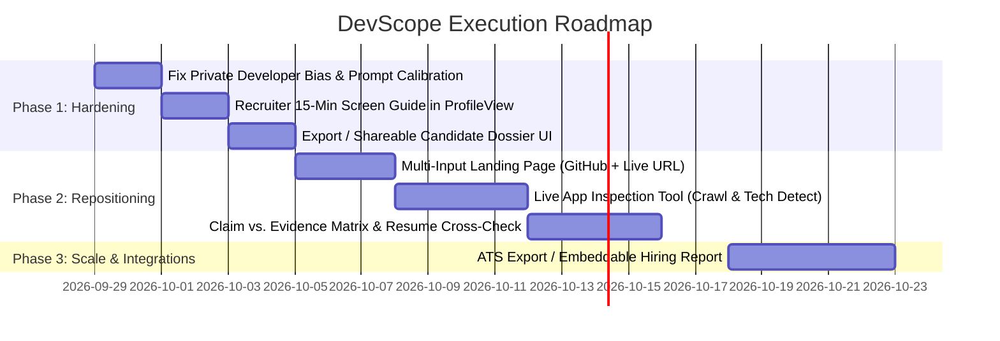

# DevScope Strategic Roadmap & Engineering Plan (2026+)

> **From "GitHub Vanity Inspector" to "Full-Spectrum Technical Talent Intelligence"**  
> *Targeting the reality of modern tech hiring: evaluating working developers, freshers, and recruiters' real screening challenges.*

---

## 1. Strategic Decision: Which Order to Execute?

### The Question:
> *Shall we first improve current version loopholes and then extend with product repositioning, OR start with repositioning and build as an overall product?*

### Recommendation: **Option A (Fix Loopholes First, but Guided by the New Vision)**

```
┌──────────────────────────────────────────────┐
│  Phase 1: Hardening Current Loopholes        │
│  (Fix false negatives, handle private devs,  │  ◄── Prevents building new features
│   graceful fallbacks, reliable SSE)          │      on shaky foundations.
└──────────────────────┬───────────────────────┘
                       │
                       ▼
┌──────────────────────────────────────────────┐
│  Phase 2: Multi-Signal Repositioning         │
│  (Live app inspection, Claim vs. Evidence,   │  ◄── Transforms DevScope into an
│   15-min Recruiter Phone Screen Dossier)     │      indispensable hiring tool.
└──────────────────────────────────────────────┘
```

#### Why Starting with Repositioning First is Risky:
If we start rewriting data models and frontend architecture for a brand new multi-input system before fixing current engine bugs (like how the agent currently evaluates developers with low public commit counts, or SSE connection drops), we risk building complex new features on a foundation that still gives poor evaluations.

#### Why Pure Bug-Fixing Without Vision is Wasteful:
If we polish v1 in a vacuum, we might spend days perfecting metrics that don't matter to recruiters (like tweaking how GitHub star counts are visualized).

#### The Optimal Path: **"Targeted Hardening with Repositioning-Ready Architecture"**
1. **Fix the existing loopholes that actively hurt working developers today** (e.g., stopping the prompt from labeling private-repo developers as "junior/inactive").
2. **Lay the modular groundwork for the repositioning** (multi-source input, recruiter cheat sheet, live app verification).

---

## 2. Current Version Loopholes & Immediate Fixes (Horizon 1)

These are the immediate flaws in the current codebase that must be fixed so the product doesn't give unfair assessments:

| Current Loophole | Where It Occurs | Real-World Impact | Immediate Fix |
|---|---|---|---|
| **The "0 Public Commits = Junior" Flaw** | [`prompts.ts`](file:///e:/rabby-xponent/Projects/devscope/backend/src/agent/prompts.ts) & [`agent.service.ts`](file:///e:/rabby-xponent/Projects/devscope/backend/src/agent/agent.service.ts) | Working developers with private company repos get rated as "junior" or "inactive". | Add explicit **"Corporate / Private Developer" awareness** to the synthesis prompt: if account age > 2 years but public commits are low, recognize potential enterprise/proprietary work rather than defaulting to junior. |
| **Missing Recruiter Actionability** | [`ProfileView.tsx`](file:///e:/rabby-xponent/Projects/devscope/frontend/components/ProfileView.tsx) | Recruiter panel gives high-level observations, but no concrete interview questions with expected answers. | Add a **"15-Minute Technical Screen Cheat Sheet"** section with exact questions, what a good answer sounds like, and red flags. |
| **No Easy Share/Export for Hiring Teams** | Frontend | Recruiters cannot easily forward a DevScope report to an engineering manager. | Add **"Copy Clean Share Link"** and a clean **Print/PDF Export view** formatted for hiring meetings. |
| **Fragile Connection Lifecycles** | [`useDevScopeStream.ts`](file:///e:/rabby-xponent/Projects/devscope/frontend/hooks/useDevScopeStream.ts) | If backend restarts or SSE is interrupted on mobile, user sees a raw failure box. | Add automatic single-reconnect and clearer user-friendly recovery states. |

---

## 3. Product Repositioning: The Next-Gen Vision (Horizon 2)

### Target Positioning:
> **"DevScope: The Technical Ground-Truth Agent for Tech Hiring."**  
> *Separating genuine engineering competence from AI-inflated resumes across all candidate levels—from freshers to mid-level working professionals.*

```
                 ┌────────────────────────────────────────────────────────┐
                 │                Candidate Submissions                   │
                 │   [ GitHub Handle ]  +  [ Live Deployed App URL ]      │
                 │              +  [ Resume Summary ]                     │
                 └───────────────────────────┬────────────────────────────┘
                                             │
                                             ▼
                 ┌────────────────────────────────────────────────────────┐
                 │                   DevScope Agent                       │
                 │   1. Public & Ecosystem Footprint                      │
                 │   2. Live Production Quality & Tech Stack Audit        │
                 │   3. Claim vs. Evidence Delta Analysis                 │
                 └───────────────────────────┬────────────────────────────┘
                                             │
                                             ▼
                 ┌────────────────────────────────────────────────────────┐
                 │                Executive Hiring Dossier                │
                 │   • Verified Competencies                              │
                 │   • Unverified Claims (Interview Probes)               │
                 │   • 15-Minute Recruiter Phone Screen Guide             │
                 └────────────────────────────────────────────────────────┘
```

### Core Innovations:

#### 1. Live Shipped Application Audit (The Game Changer for Junior & Mid-Levels)
* **What it does:** Allows entering a live project URL (e.g., `https://my-saas.vercel.app` or portfolio demo).
* **Agent action:** Crawls the production site, inspects DOM structure, measures bundle responsiveness, inspects API network calls, and detects the deployed tech stack.
* **Why it wins:** Working developers who can't show private code **can** show their live deployed applications and side projects.

#### 2. Claim vs. Evidence Matrix ("Resume Reality Check")
* Compares what the candidate claims on their resume/LinkedIn against real engineering artifacts:
  - **Verified:** Technologies proven through code or production builds.
  - **Partially Verified:** Stack present in dependencies or readmes without deep implementation visible.
  - **Unverified Probe:** Buzzwords with no artifact evidence, highlighting where interviewers should focus.

#### 3. Recruiter "Phone Screen Cheat Sheet"
* Tailored questions calibrated to the candidate's exact stack:
  - Question: *"How did you handle state synchronization across tabs in your app?"*
  - Good response indicators: *"Mentions BroadcastChannel, LocalStorage events, or React Query cache."*
  - Warning signs: *"Vague buzzwords without implementation specifics."*

---

## 4. Step-by-Step Implementation Roadmap



### Phase 1 (Immediate Next Steps — Days 1 to 5):
1. **Calibrate Synthesis Prompt ([`prompts.ts`](file:///e:/rabby-xponent/Projects/devscope/backend/src/agent/prompts.ts)):**
   - Eliminate bias against developers with low public commit counts.
   - Detect career stage accurately without penalizing private enterprise work.
2. **Upgrade Recruiter Panel ([`ProfileView.tsx`](file:///e:/rabby-xponent/Projects/devscope/frontend/components/ProfileView.tsx)):**
   - Add the structured **15-Minute Phone Screen Guide** (Question + Expected Good Answer + Red Flag).
3. **Add Clean Sharing & Print Export:**
   - One-click copyable candidate summary link and print-optimized PDF layout.

### Phase 2 (Product Expansion — Days 6 to 14):
1. **Multi-Input Intake UI:**
   - Expand the landing page to accept `[GitHub Handle]` + `[Optional Deployed Project URL]`.
2. **Live URL Inspection Tool:**
   - Add a lightweight crawler tool that inspects the live app's performance, frontend stack, and API ergonomics.
3. **Claim vs. Evidence Matrix:**
   - Introduce visual badges for Verified vs. Unverified skills.

---

## 5. Summary & Recommendation

We will execute **Phase 1 first** (tightening our current analysis engine so it never misjudges working developers, and immediately adding recruiter-focused screening questions), which will give you an instantly usable product today. We will then cleanly build **Phase 2** (live project URLs and claim verification) on top of a rock-solid foundation.
